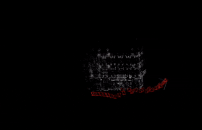
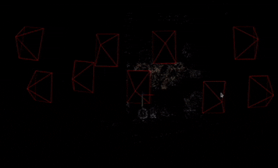

# 3D Scene Reconstruction from Photos 🏙️➡️🖥️


Turn your 2D photos into a 3D model automatically! This tool uses computer vision to reconstruct scenes from ordinary pictures.
This repository implements an Incremental Structure from Motion **(SfM) pipeline** for 3D scene reconstruction from a dataset of 2D images. The pipeline extracts a sparse 3D point cloud and estimates camera poses by leveraging SIFT feature matching, epipolar geometry, triangulation, Perspective-n-Point (PnP) pose estimation, and bundle adjustment. The project explores both traditional optimization methods via SciPy and gradient-based optimization using PyTorch for bundle adjustment. The final reconstruction can be exported to the COLMAP format for visualization and further processing.

## 🌟 Features

- Creates 3D models from your photo collection
- Works on Windows/Mac/Linux
- No advanced technical knowledge needed
- Free and open-source

## Code Flow:

1.  In case you use custom dataset, we assume that you already calibrated your camera. If not, please use the [This Notebook](calibration_notebook.ipynb) to calibrate your camera and store the camera intrinsics **K** for later use.
2.  Extracting SIFT features and matching them robustly across image pairs using Lowe's ratio test and RANSAC-based Fundamental matrix filtering.
3.  Selecting an optimal initial image pair and performing an initial 3D reconstruction via triangulation.
4.  Incrementally adding new views by estimating their poses using PnP and triangulating new 3D points.
5.  Globally optimizing all camera poses (represented by a 3x3 rotation matrix and a 3x1 translation vector) and 3D point locations via Bundle Adjustment to minimize reprojection errors. Both SciPy's `least_squares` and PyTorch's `Adam` optimizers are explored.
6.  Colorizing the final 3D point cloud based on image observations and exporting the reconstruction to the COLMAP format.

The final output includes the sparse 3D point cloud and the estimated camera poses and trajectory.

## 🛠️ Installation (3 Simple Steps)

### 1. Install Python

Download and install Python 3.8 from [python.org](https://www.python.org/downloads/). Check "Add Python to PATH" during installation.

### 2. Download the Project

```bash
git clone https://github.com/yourusername/3d-reconstruction-tool.git
cd 3d-reconstruction-tool
```

### 3. Install Requirements

```bash
pip install -r requirements.txt
```

## How to Use

### 1. Add your photos to the datasets/my_photos folder (create the folder if needed)

### 2. Run the program:

```bash
python3 main.py
```

Other arguments can be added to the command line, for example:

```usage: main.py [-h] [--use_pytorch_optimizer USE_PYTORCH_OPTIMIZER]
[--show_plots_interactively SHOW_PLOTS_INTERACTIVELY] [--save_plots SAVE_PLOTS]
[--imgset IMGSET] [--n_imgs N_IMGS] [--k_matrix K_MATRIX] [--img_type IMG_TYPE]

Run Structure from Motion (SfM) pipeline.

optional arguments:
-h, --help                                          show this help message and exit
--use_pytorch_optimizer USE_PYTORCH_OPTIMIZER
                                                    Set to False to use Scipy optimizer (slow) for Bundle Adjustment. Default: True
--show_plots_interactively SHOW_PLOTS_INTERACTIVELY
                                                    Set to True to display plots interactively. Default: False
--save_plots SAVE_PLOTS
                                                    Set to True to save generated plots to files. Default: False
--imgset IMGSET                                     Name of the image dataset (e.g., "templeRing", "dino"). Default: templeRing
--n_imgs N_IMGS                                     Number of images to process in the dataset. Default: 46
--k_matrix K_MATRIX                                 Camera intrinsic matrix K as a string representing a 3x3 array. Example: "[[1520.40, 0.00, 302.32], [0.00, 1525.90, 246.87], [0.00, 0.00, 1.00]]"
--img_type IMG_TYPE                                 Image file extension (e.g., "png", "jpg", "JPG"). Default: png
```

### 4. View your 3D model - it will automatically open when complete!

## 📂 Where to Find Results

#### 3D Model: Saved in colmap_export/my_photos/

#### Visualizations: Stored in output_plots/

## Results

The pipeline produces:

- A sparse **3D Point Cloud** and estimated **Camera Poses**.
- Reprojection error is typically reduced to **< 1 pixel** after Bundle Adjustment.
- Successfully reconstructs scenes from datasets like "templeRing" (46 images) and custom datasets.

## 💡 Tips for Best Results

✔️ Use 20-50 photos for good coverage

✔️ Maintain ~60% overlap between photos

✔️ Avoid blurry or very dark images

✔️ Capture from different angles

**Sample Visualizations:**

- **Custom Dataset Reconstruction [Robot from Lab]:**
  

  _Caption: Reconstruction of a custom object dataset._

- **Custom Dataset Reconstruction:**
  

  _Caption: Reconstruction of Pharmacy at molette in Le Creusot._

- **Custom Dataset Reconstruction:**
  

  _Caption: Reconstruction of corn flakes cereal box._

- **Middlebury Dataset Reconstruction:**
  

  _Caption: Reconstruction results from the "TempleRing" dataset._

- **Few-Image Reconstruction:**
  

  _Caption: Preliminary reconstruction from a limited number of input images._

- **Custom Datasets (COLMAP Visualization):**
  
  _Caption: Preliminary reconstruction of unknown object in park near molette._

---

## 🆘 Need Help?

Open an issue on GitHub or email: rafay.aamir.gull@gmail.com

## 📜 License

MIT License - free for academic and commercial use
